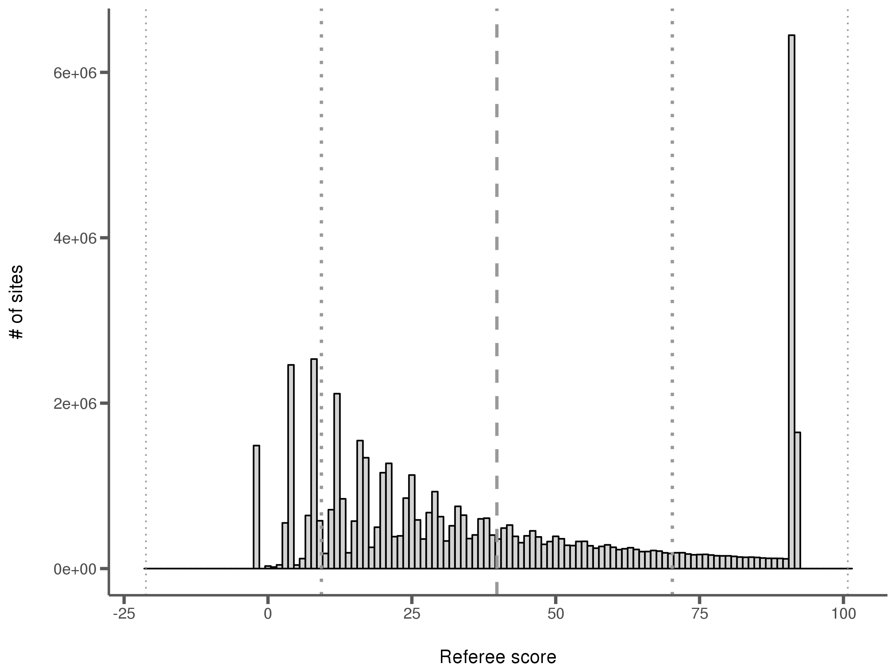
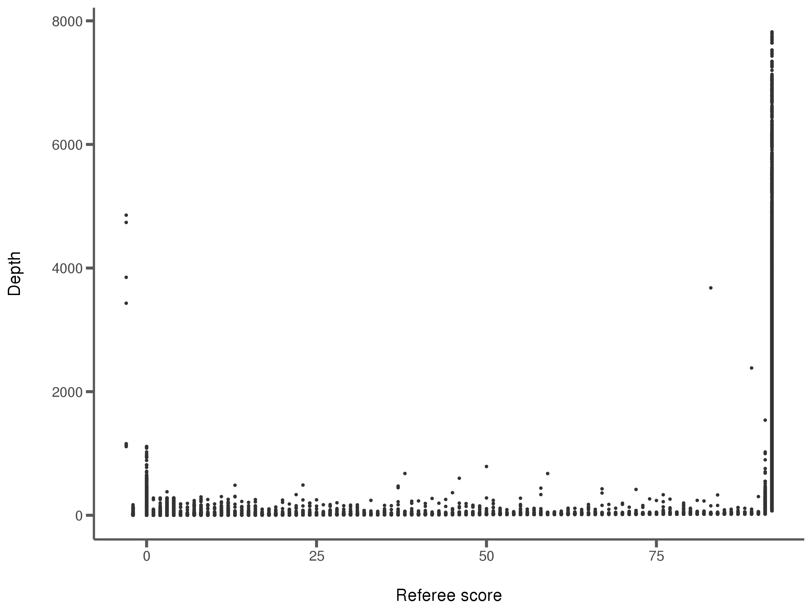
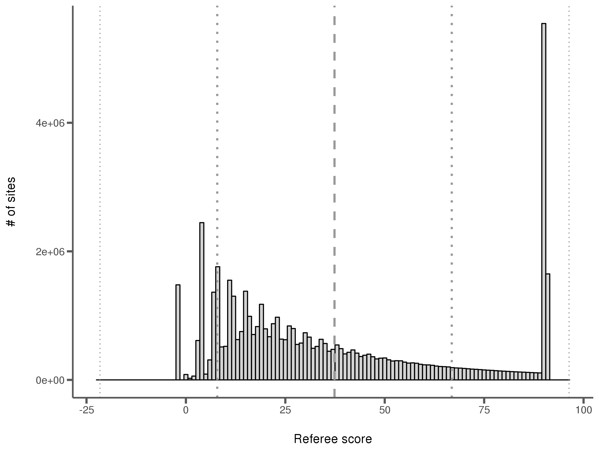
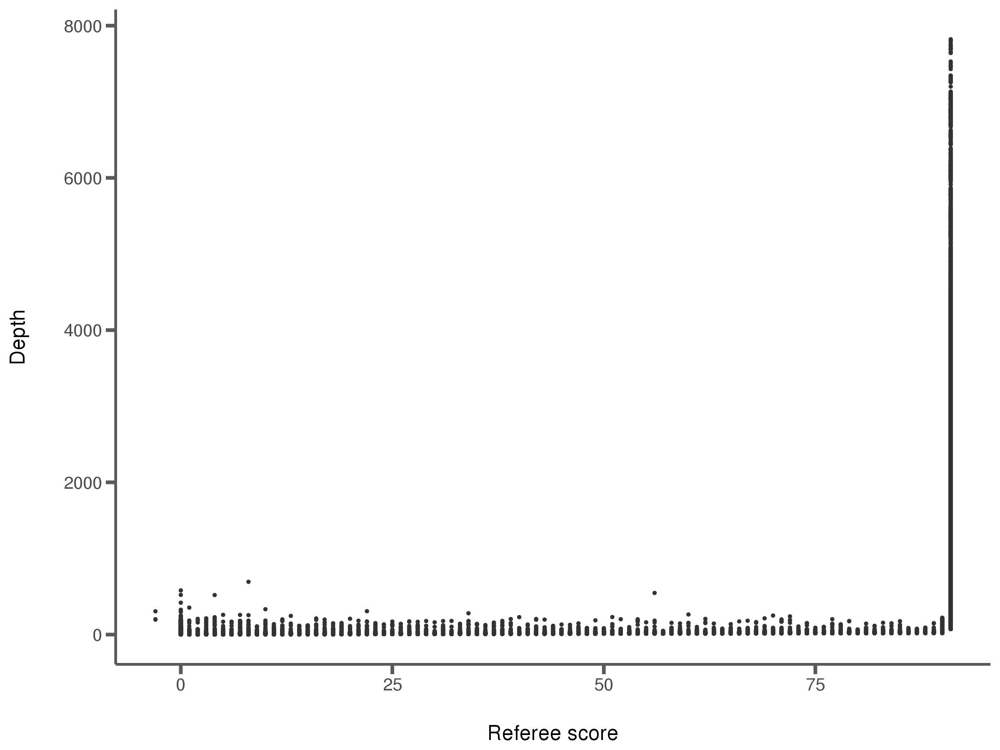
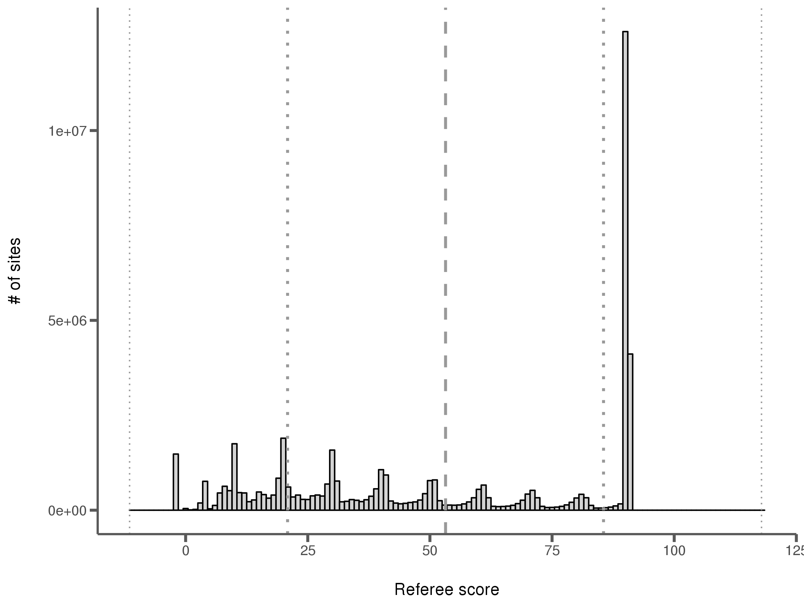
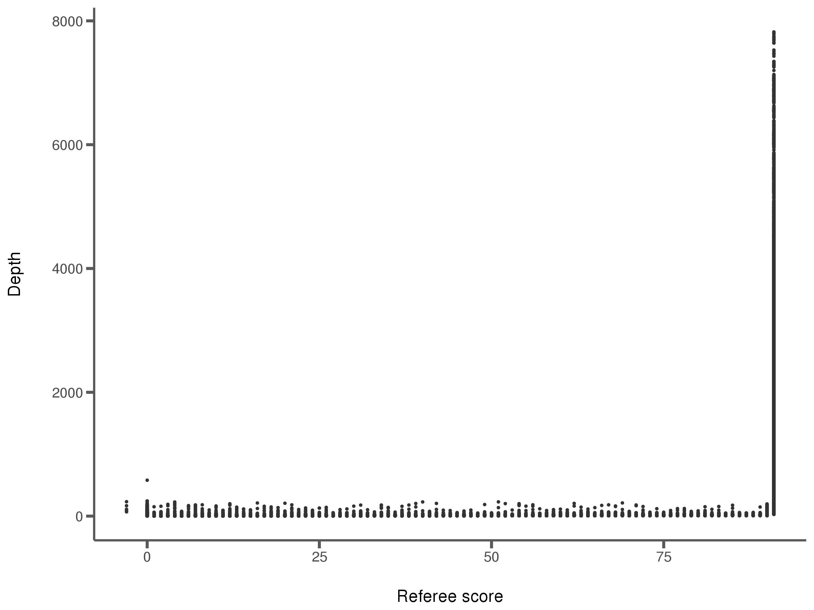
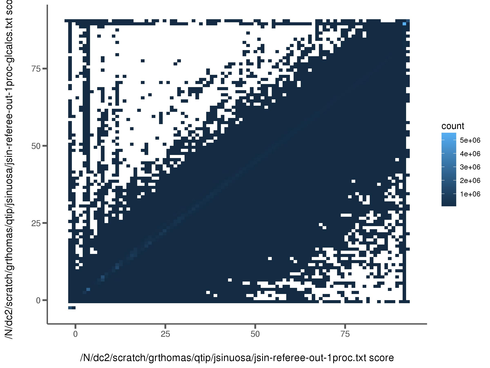
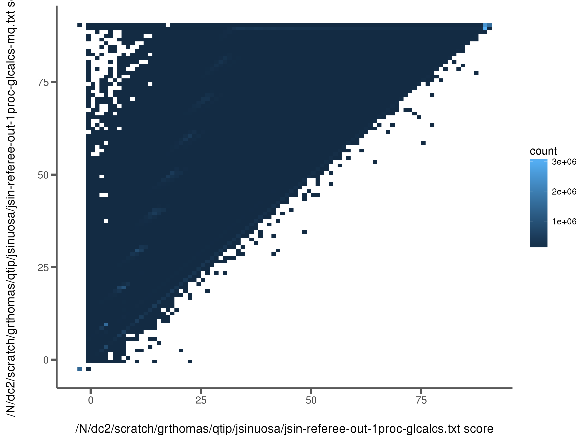

## *J. sinuosa* transcriptome

The *J. sinuosa* reads for vegetative tissues were downloaded with fastq-dump from NCBI [SRA SRX2676125](https://www.ncbi.nlm.nih.gov/sra/SRX2676125[accn]). These reads were assembled with Trinity using default parameters:

```
Trinity --seqType fq --max_memory 100G  --left SRR5380902_1.fastq  --right SRR5380902_2.fastq --CPU 8
```

The reads were mapped back to the resulting transcriptome assembly:

```
bwa mem Trinity.fasta SRR5380902_1.fastq SRR5380902_2.fastq > SRR5380902.sam
```

A few additional steps were performed: 1) create the sequence dictionary to add to the SAM header because this output lacked the @HD line needed later on, 2) Add the header from the dict, 3) Convert to BAM, 4) Sort BAM.

Next, genotype likelihoods were calculated with ANGSD:

```
angsd -GL 2 -i SRR5380902-sorted.bam -ref Trinity.fasta -minQ 0 -doGlf 4 -out jsinuosa-angsd
```

And reference quality scores calculated with Referee:

```
referee.py -gl jsinuosa-angsd.glf.gz -ref Trinity.fasta --fastq --correct -o jsinuosa-referee
```

Additionally, two pileup files were created from the BAM file to test Referee's genotype likelihood calculations. One with mapping quality and one without (the -s flag controls mapping quality output):

```
samtools mpileup -d 999999999 -f <reference.fa> -Q 0 -s -o jsinuosa-mq.pileup SRR5380902-sorted.bam
```

The pileup was used by Referee to calculate genotype likelihoods and qualit scores:

```
referee.py -gl jsinuosa-mq.pileup -ref Trinity.fasta --pileup --fastq --correct -o jsinuosa-referee-glcalcs-mq
```

Here are some statistics from this process:

<center>
| Description                          | Value         |
|--------------------------------------|---------------|
| Size of assmembled transcriptome     | 53.96 MB      |
| # Transcripts                        | 55,567        |
| Bases                                | 50,283,993    |
| Size of sorted BAM file              | 1.01 GB       |
| Average read depth                   | 19.53         |
| Time to run ANGSD                    | 7.98 min      |
| Mapped sites with ANGSD calcs        | 48,791,504    |
| Time to run Referee (1 proc)         | 18.69 min     |
| Size of Referee output (tab)         | 1.67 GB       |
| Size of Referee output (fastq)       | 124.97 MB     |
</center>

### Referee run time on *J. sinuosa* data

<center> {width=75%} </center>
</br>

### Referee memory usage on *J. sinuosa* data

<center> {width=75%} </center>

### Comparing scores from different genotype likelihood methods on *J. sinuosa* data

</br>
<center>
| Calculation method | $L_{mismatch}$ = 0 ($R_Q$ = 91) | Reference is N ($R_Q$ = -1) | No reads mapped ($R_Q$ = -2)   |
|--------------------|-------------------------------|-----------------------------|--------------------------------|
| ANGSD              | 1646845                       | 0                           | 1487227                        |
| Pileup without MQ  | 1648828                       | 0                           | 1478554                        |
| Pileup with MQ     | 4113594                       | 0                           | 1478554                        |
</center>

### Referee score distributions and read depth correlations with the three different methods

#### ANGSD

<center> {width=75%} </center>
</br>

<center> {width=75%} </center>
</br>

#### Pileup (no MQ)

<center> {width=75%} </center>
</br>

<center> {width=75%} </center>
</br>

#### Pileup (with MQ)

<center> {width=75%} </center>
</br>

<center> {width=75%} </center>
</br>

### ANGSD scores vs. Referee pileup scores (no MQ)
<center> {width=75%} </center>
</br>

### Referee pileup scores (no MQ) vs. Referee pileup scores (with MQ)
<center> {width=75%} </center>
</br>

## Owl monkey genome

The owl monkey reference genome was obtained from NCBI [GCA_000952055.2_Anan_2.0](ftp://ftp.ncbi.nlm.nih.gov/genomes/all/GCA/000/952/055/GCA_000952055.2_Anan_2.0) and the reads were mapped back to this assembly by colleagues at Baylor for the Owl monkey pedigree project. The BAM file was split by scaffold for parallelizaiton of ANGSD calcs. This splitting shouldn't effect the Referee performance, though it means I don't have genome-wide score distributions.

Here are some statistics from this genome:

<center>
| Description                          | Value         |
|--------------------------------------|---------------|
| Size of assmembled genome            | 2.90 GB       |
| # Scaffolds                          | 22,922        |
| Bases                                | 2,861,668,348 |
| Size of sorted BAM file              | 561.67 GB     |
| Average read depth                   | 151.698       |
| Time to run ANGSD                    | 54.38 min     |
| Mapped sites with ANGSD calcs        | 2,664,619,299 |
| Time to run Referee (1 proc)         | 17.33 hrs     |
| Size of Referee output (tab)         | 7.6 GB        |
| Size of Referee output (fastq)       | 608 MB        |
| $L_{mismatch}$ = 0 ($R_Q$ = 91)      |               |
| Reference is N ($R_Q$ = -1)          |               |
| No reads mapped ($R_Q$ = -2)         |               |
</center>

### Referee run time on Owl monkey and *J. sinuosa* data

<center> {width=75%} </center>
</br>

### Referee memory usage on Owl monkey and *J. sinuosa* data

<center> {width=75%} </center>

